# Git & Github Assignment

## Overview

This repository demonstrates core Git and GitHub workflows including:

1. Repository initialization
2. Tracking and committing changes
3. Branching and merging
4. Handling errors using stash, reset, and revert

---

## Question 1: Project Initialization & First Push

### Objective
Set up a new Git project and push it to a remote repository.

### Scenario
You are starting a new Python project. You need to track your work using Git and upload it to a remote repository.

### Project Structure
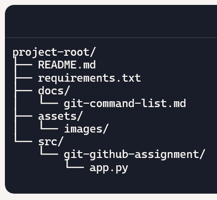

### GitHub Steps
1. Go to GitHub: https://github.com
2. Login to your account
3. Click New Repository
4. Enter repository name (e.g., git-github-assignment)
5. Choose Public/Private
6. Do NOT initialize with README (if pushing local project)
7. Click Create Repository
8. Copy remote URL and connect using git remote add origin
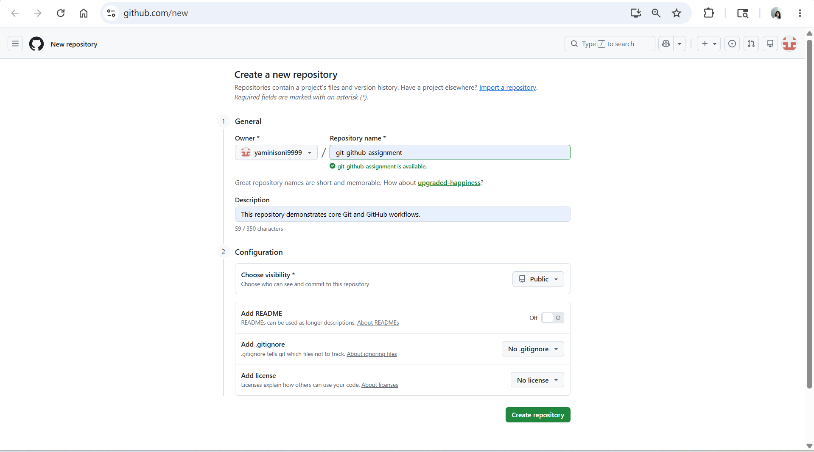

### Git Steps
1. Go to official website: https://git-scm.com/install/windows
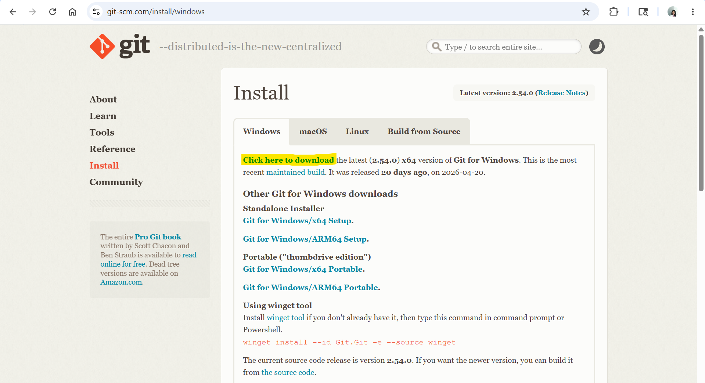
2. Download Git for Windows
3. Run the installer
4. Keep default options (recommended)
5. Make sure this option is selected: “Git from the command line and also from 3rd-party software”
6. Complete installation
7. Open Command Prompt / Git Bash and run following commands
```bash
#verify git installation
git --version
```
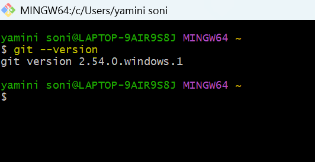

```bash
#configure git
git config --global user.name "Your Name"
git config --global user.email "youremail@example.com"
#check git configuration
git config --list
```
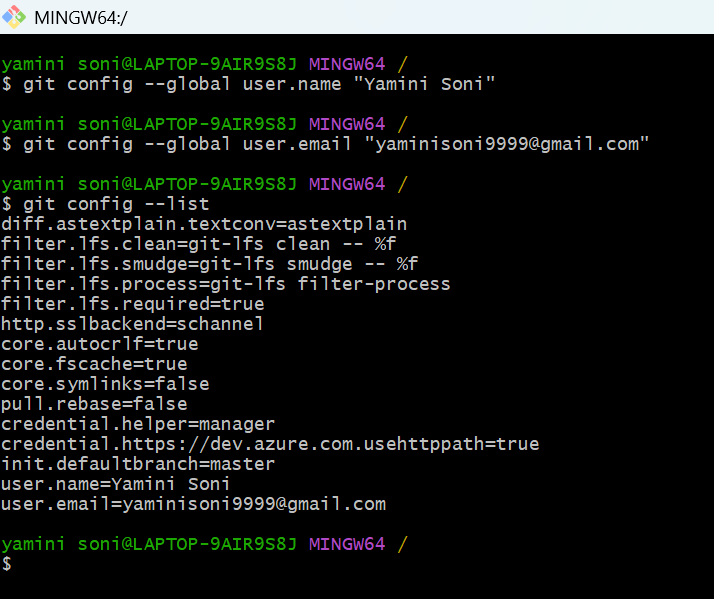

```bash
#Create a new folder for your project
mkdir Git_Github_Assignment
cd Git_Github_Assignment

#Create project structure
mkdir docs
mkdir src
mkdir src/git-github-assignment
mkdir assets
mkdir assets/images
touch README.md
touch requirements.txt
touch docs/git-command-list.md
touch src/git-github-assignment/app.py
find . -print
```
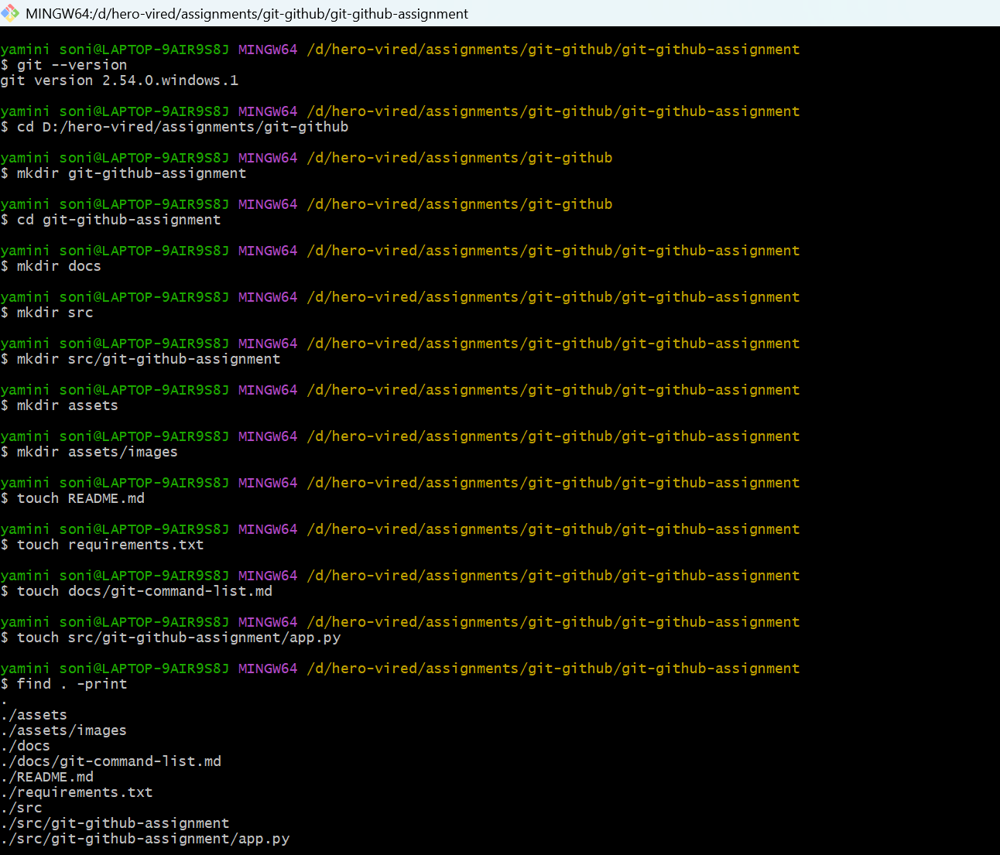

```bash
# Initialize Git repository
git init

#Create a file named app.py and add some Python code
echo "print('Hello, This is a python file for github assignment')" > src/git-github-assignment/app.py

#Check the current Git status
git status

#Stage the file
git add src/git-github-assignment/app.py
#git add .

#Commit with a meaningful message
git commit -m "Initial commit: add code in app.py"
```
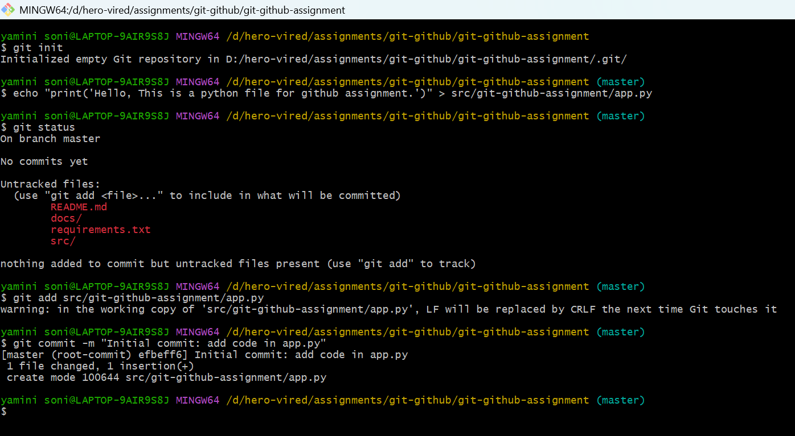

```bash
#Create a remote repository - refer above section : GitHub Setup Steps

#Add the remote (origin) to your local repo
git remote add origin https://github.com/yaminisoni9999/git-github-assignment.git

#Verify the remote configuration
git remote -v

#Push your code to the remote repository
git branch -M main
git push -u origin main
#git push
```
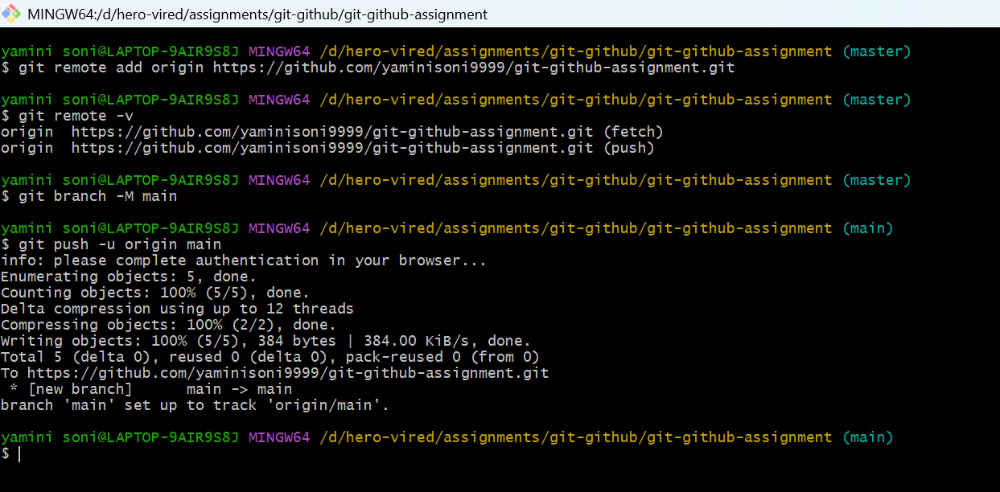

### Output

* Local project is tracked using Git
* Code is pushed to GitHub repository
* Version control is successfully set up

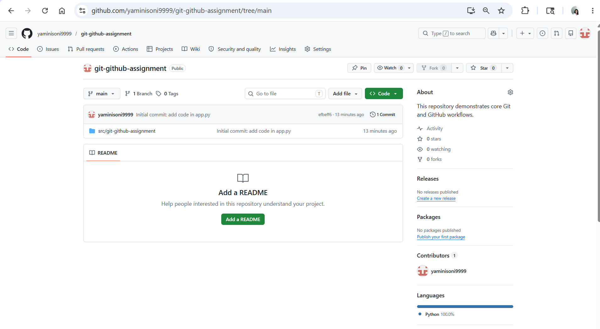

### Learning Outcomes

By completing this assignment, I learned:

- How to install and configure Git on Windows
- How to initialize a local Git repository
- How to create and manage project structure
- How to stage, commit, and push changes
- How to connect local repo with GitHub remote repository
- Basic Git commands for version control

## Question 2: Working with Changes & History

### Objective
Track code changes and manage commit history properly.

### Scenario
You are enhancing your existing app.py application with new features.

### Git Steps
```bash
#Modify app.py by adding new functionality
echo "print('Added a new functionality.')" > src/git-github-assignment/app.py

#Check what changes are made before staging
git status
```
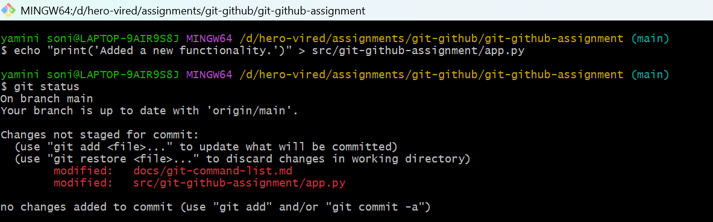

```bash
#View differences in the file
git diff rc/git-github-assignment/app.py

#Stage only specific changes (if possible)
git add -p

#Commit with a clear message
git commit -m "updated app.py file => added new functionality"
```
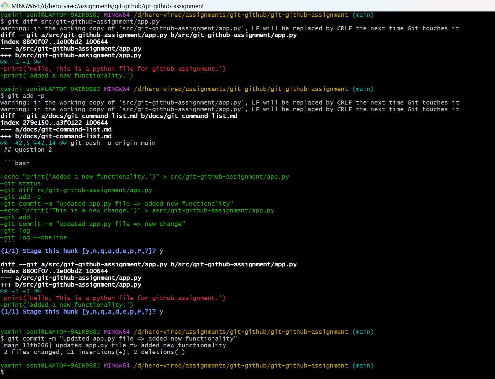

```bash
#Make another change in app.py
echo "print('This is a new change.')" > src/git-github-assignment/app.py

#Stage all changes
git add .

#Commit again
git commit -m "updated app.py file => new change"
```
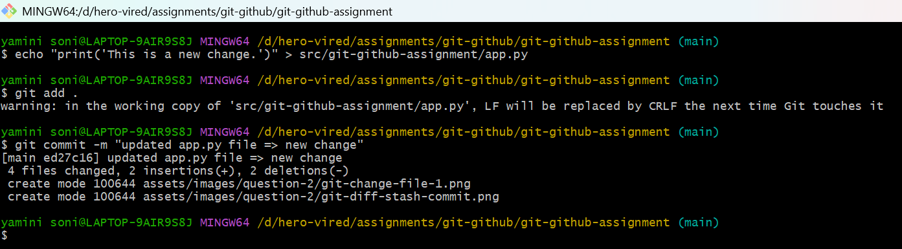

```bash
#View full commit history
git log
```
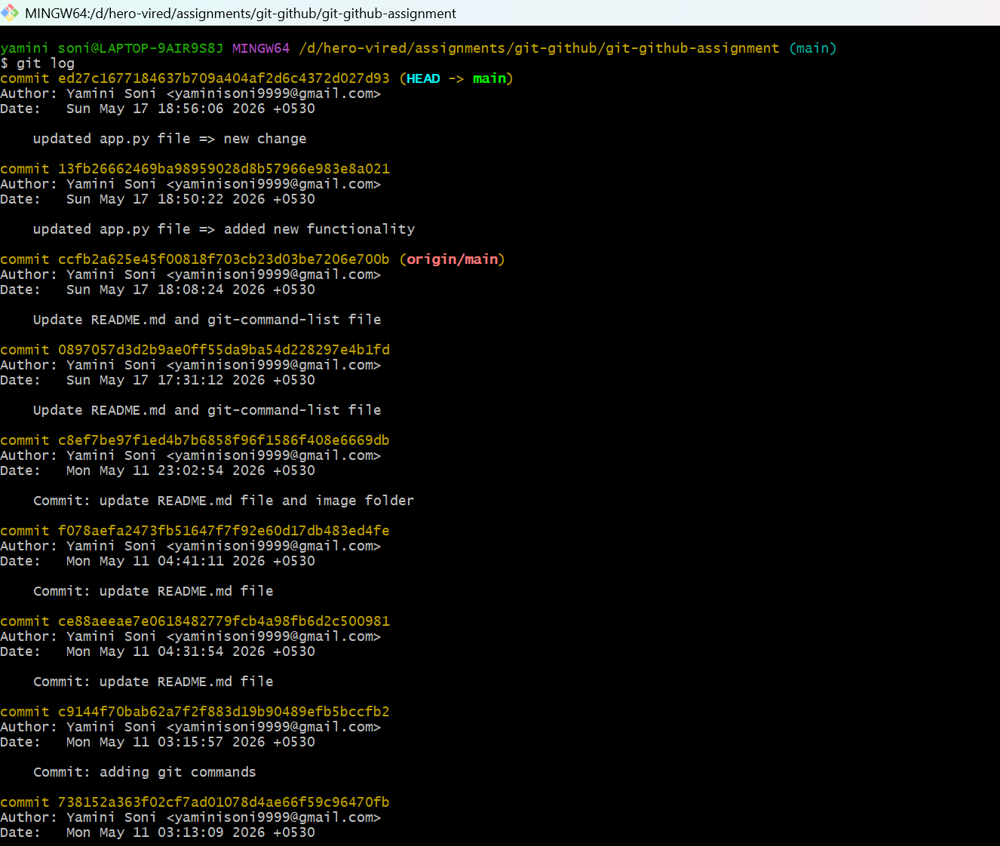

```bash
#View compact (one-line) history
git log --oneline
```
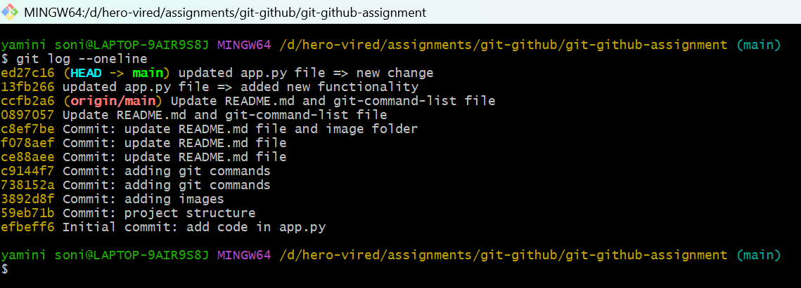

### Output

* Successfully modified the app.py file with additional functionality.
* Verified file changes using git status.
* Compared modifications using git diff.
* Staged selected and complete changes using git add commands.
* Created multiple commits with meaningful commit messages.
* Viewed detailed commit history using git log.
* Viewed compact commit history using git log --oneline.

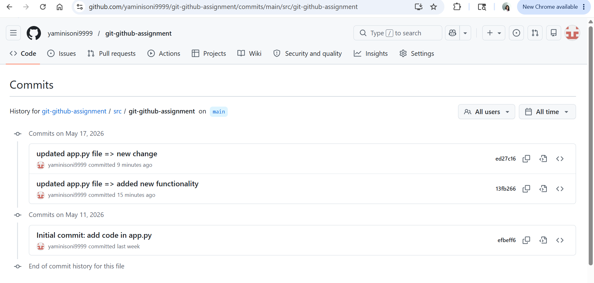

### Learning Outcomes

By completing this assignment, I learned:

* How to track and manage code changes using Git
* How to check repository status before staging changes
* How to compare file modifications using git diff
* How to stage selected changes using git add -p
* How to stage all project changes using git add .
* How to create meaningful commits with proper commit messages
* How to maintain project history using multiple commits
* How to view detailed commit history using git log
* How to view compact commit history using git log --oneline
* Basic Git workflow used in version control systems